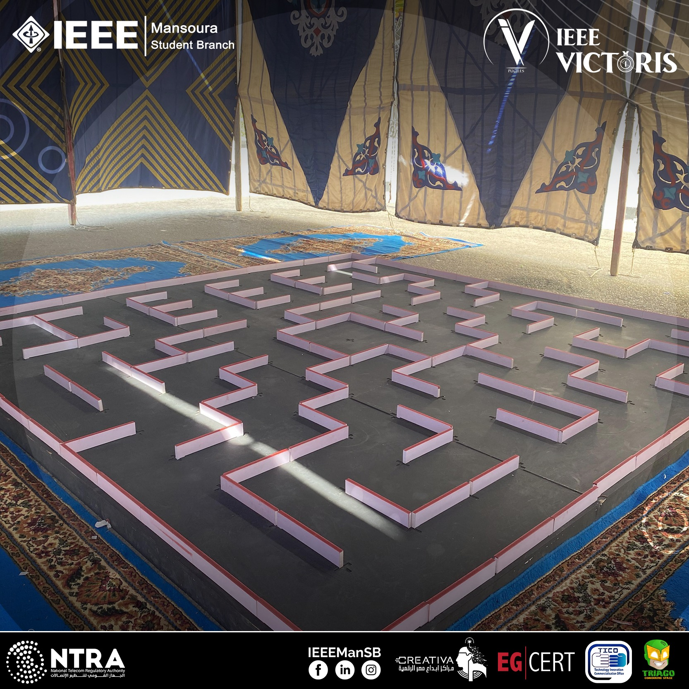
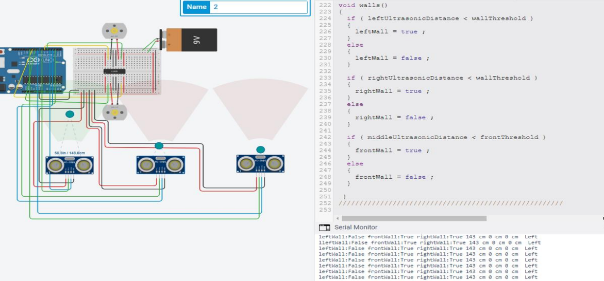
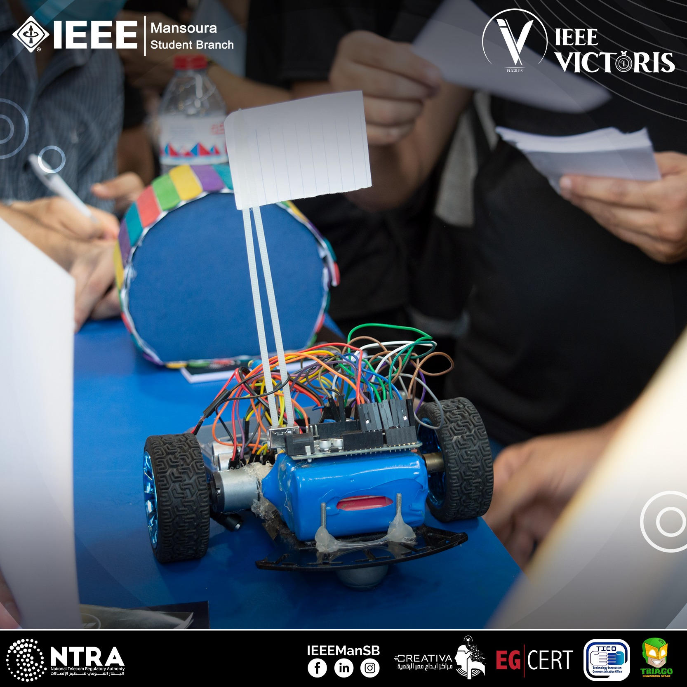
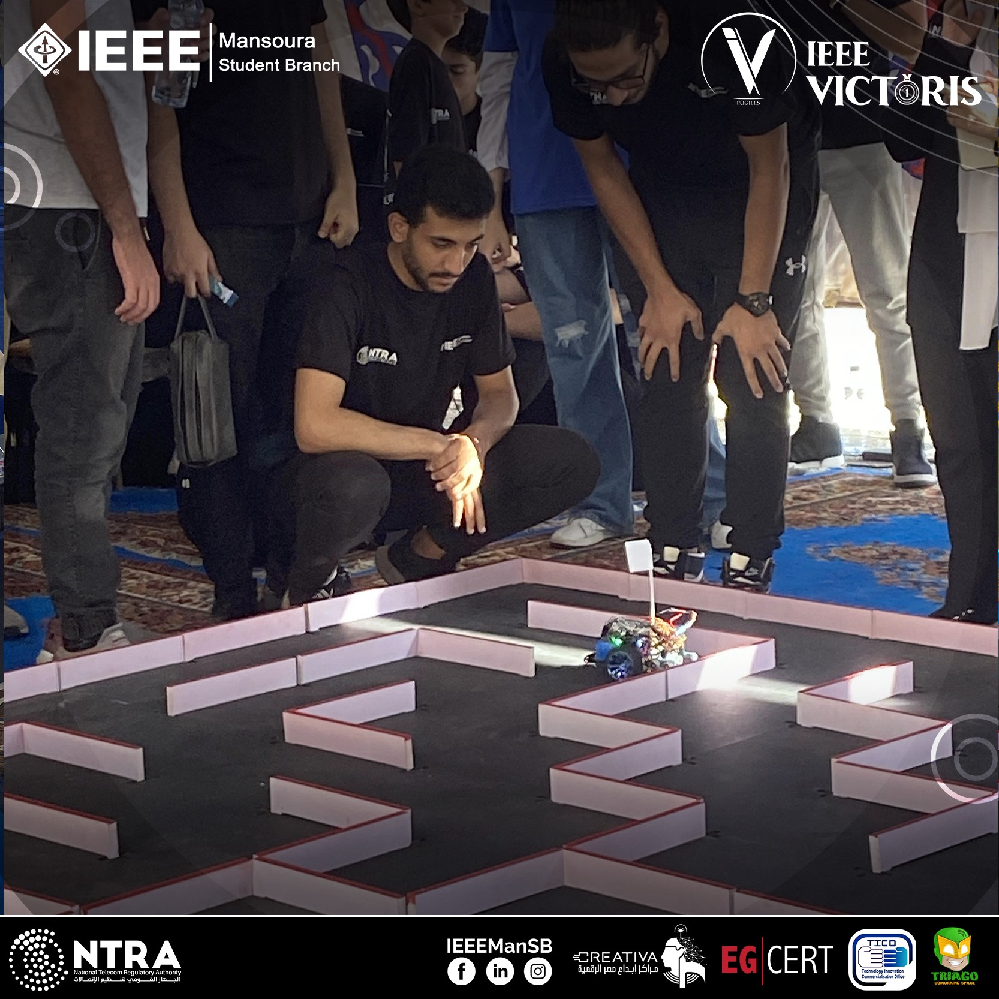

# Micromouse Competition Robot

## Overview
This repository contains the code and documentation for an autonomous robotic "mouse" designed to navigate a maze in the shortest time possible. The robot was created for participation in a micromouse competition.

## Objective
The objective of the micromouse competition is to design and build an autonomous robotic "mouse" that navigates a maze of standard dimensions from a specified corner to its end in the shortest time.

## Hardware
- Arduino UNO
- Ultrasonic sensors
- DC motors
- Arduino uno shield
- Chassis, wheels, and other mechanical components

## Simulation
The robot's behavior and navigation algorithms were tested in simulation environments using software such as [Robotics Simulator](https://www.roboticsimulator.com/). Below are some screenshots from the simulation:

## Usage
1. Power on the robot and place it at the starting position of the maze.
2. The robot will autonomously navigate the maze using the programmed logic.

## Competition
Here are some photos from inside the micromouse competition:

